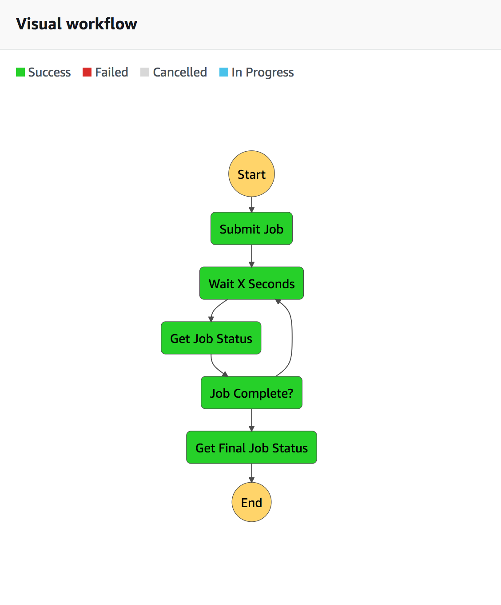

# buildkite-serverless-agent

This project deploys a serverless [buildkite](https://buildkite.com/) agent which comprised of a bunch of [AWS Lambda](https://aws.amazon.com/lambda/) functions, an [AWS codebuild](https://aws.amazon.com/codebuild/) project and an [AWS stepfunction](https://aws.amazon.com/step-functions/) state machine which manages long running jobs.

The aim of this stack is:

1. Low IDLE cost
2. Running builds in an isolated sandboxed env, such as codebuild
3. Give the build container least privilege access to AWS
4. Simple to scale up, again using codebuild, so 10 concurrent jobs should be ~approx the same as 1 job
5. Cheap to run for small number of short (less than 5 minute) builds spread throughout the day

# disclaimer

This project is **not** currently supported by buildkite, I built this as an experiment and currently it works really well for me. The buildkite team has been super supportive in my endeavour so a big thanks goes to them.

# prerequisites

Before you start you need.

1. An AWS account with admin level access.
2. An S3 bucket in the account to stage [cloudformation](https://aws.amazon.com/cloudformation/) artifacts.
3. The [AWS CLI](https://aws.amazon.com/cli/).
4. [direnv](https://direnv.net/) or the like to manage env variables using `.envrc`.
5. [golang](https://golang.org) to build the lambda projects.
6. This project cloned into your `$GOPATH` at `src/github.com/wolfeidau/buildkite-serverless-agent`

# conventions

Throughout the code you will see reference to environments, this convention enables you to run a group of dependent components which are linked together based on:

* `EnvironmentName` Name of the environment could be dev, test or prod. 
* `EnvironmentNumber` Number for the environment, Typically 1 - n.

The other convention used is the linking of cloudformation stacks by passing in the name of a stack, rather than nesting or the like. This takes advantage of imports / exports, which you can read about at [Exporting Stack Output Values
](https://docs.aws.amazon.com/AWSCloudFormation/latest/UserGuide/using-cfn-stack-exports.html) 

# setup

Before we start we need to upload some configuration to amazon for the buildkite agent.

**Note**: You need to configure some environment variables as per the `.envrc.example`.

* This will import your agent SSH key (used to clone code from github/bitbucket/gitlab) into SSM and store it encrypted.

```
aws ssm put-parameter --name '/dev/1/buildkite-ssh-key' --value 'file://~/temp/id_rsa-testci' --type SecureString
```

* This will import your buildkite agent key into SSM and store it encrypted.

```
aws ssm put-parameter --name '/dev/1/buildkite-agent-key' --value 'xxxxx' --type SecureString
```

Then build and deploy all the serverless components.

```
make
```

This makefile will Launch a stack which deploys:

* A codebuild project to run the buildkite jobs.
* A stepfunction based job monitoring state machine project, and lambda functions.
* The `agent` lambda, which connects to buildkite and starts jobs using the stepfunction.

It also uploads the buildkite codebuild project which runs the `buildkite-agent bootstrap` process in codebuild. This is done by uploading a zip file named `buildkite.zip` to the S3 bucket created as a part of the buildkite codebuild project cloudformation. The template for this zip file is located at `codebuild-template`.

# usage

There are a few overrides which can be added to your pipeline configuration in the buildkite site, these use env variables.

* `CB_IMAGE_OVERRIDE` Override the docker image to use.
* `CB_COMPUTE_TYPE_OVERRIDE` Override the compute type, options are `BUILD_GENERAL1_SMALL | BUILD_GENERAL1_MEDIUM | BUILD_GENERAL1_LARGE`. 
* `CB_PRIVILEGED_MODE_OVERRIDE` Override whether or not privileged mode is enabled.

# codebuild job monitor step functions

To enable monitoring of the codebuild job which could run for a few minutes I am using AWS step functions, this workflow is illustrated in the following image.

This workflow is triggered by the `agent` lambda which polls the job queue via the buildkite REST API. Once triggered the statemachine flags the job as in progress, streams logs to buildkite, and marks the job as complete once it is done.

There are three other lambda functions which are used in the step functions:

* `sfn-submit-job` which notifies the buildkite api the job is starting and submits the job to codebuild.
* `sfn-check-job` which checks the status of the codebuild job and uploads logs every 10 seconds.
* `sfn-complete-job` which notifies the buildkite api the job is completed, either successful or failed, and uploads the remaining logs.



# todo

Still lots of things to tidy up:

- [x] Secure all the lambda functions IAM profiles
- [ ] Testing
- [x] Combine all the templates into one deployable unit
- [ ] Ensure all the step function lambdas are idempotent as they WILL retry at the moment.
- [ ] Currently only uploading 1MB of logs per 10 seconds, need to tune this and refactor the last upload to correctly flush the remaining data.
- [ ] Sort out versioning of the project and build files.

Some notes / suggestions for the buildkite team:

* Draw a diagram of agent call flow and timeouts related
* Document the currently internal API from the agent project

# authors

* Mark Wolfe [@wolfeidau](https://twitter.com/wolfeidau)

# license

This project is released under Apache 2.0 License.